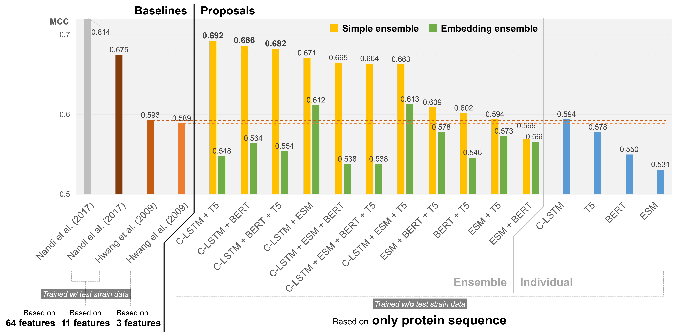

# Deep learning based Essential Gene Prediction

## Introduction
This repository provides the source code and example test datasets used to reproduce the test environments for each model introduced in our paper, *"Deep Learning Based Bacterial Essential Gene Prediciton Solely on the Protein Sequences"* Additionally, it includes a comprehensive dataset of approximately 280,000 bacterial essential genes collected from 79 studies. Users can utilize the example code and data to replicate the processes of protein sequence embedding and essential gene classification. Furthermore, with minor modifications to the provided examples, users can test the models and make predictions using their own data.

## Key Features

- **Protein Sequence Only**: Predict essential genes using only protein sequences without complex data integration.

## Performance



## Repository Structure

- **`data/raw_data/`**: Gene data by each strain ('essentiality', 'protein_seq', 'dna_seq', 'genome_id', 'locus_tag', etc.).
- **`data/test_exam/`**: Example test datasets consisting of genes from *E. coli* Keio collection.
- **`models/`**: Models to predict essential genes ('classifier_~') or encode protein sequences (embed_custom).
- **`results/`**: Model evaluation, prediction results and model training history.
- **`sources/`**: Jupyter notebook codes for sequence embedding ('emb ~') or model test and prediction ('test ~').

## How to Use

1. **Clone the repository**:
   ```bash
   git clone https://github.com/sblabkribb/deessgene.git
   cd deessgene
   ```

2. **Install dependencies**:
   ```bash
   pip install -r requirements.txt
   ```

3. **Set options (data_path, etc.) in each source code**:
   ```python
   # Set options
   embed_ver = ["clstm", "esm2", "bert", "t5"]
   data_path = "../data/test_exam/"
   model_path = f"../models/classifier_indiv/"
   result_path = f"../results/"
   ```
4. **Run the source code**


## Citation

To cite this work, please reference:
```
Seongbo Heo et al. "Deep Learning Based Bacterial Essential Gene Prediction Solely on the Protein Sequences." Synthetic Biology Research Center, KRIBB.
```

## Acknowledgments

This project was supported by the **Korea Research Institute of Bioscience and Biotechnology (KRIBB)** and the **National Research Foundation of Korea**.

